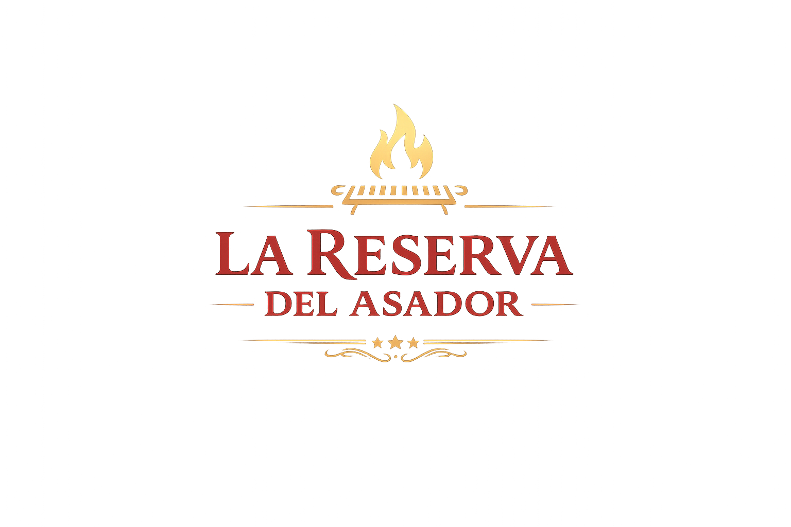
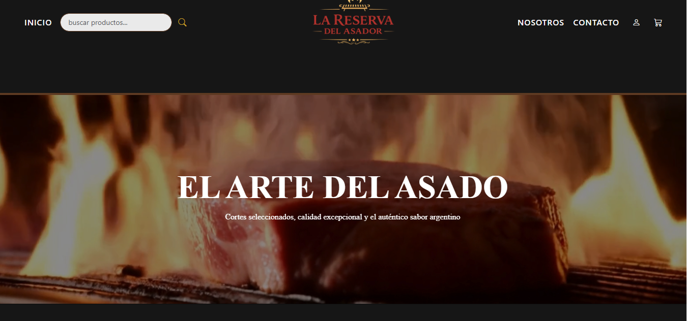
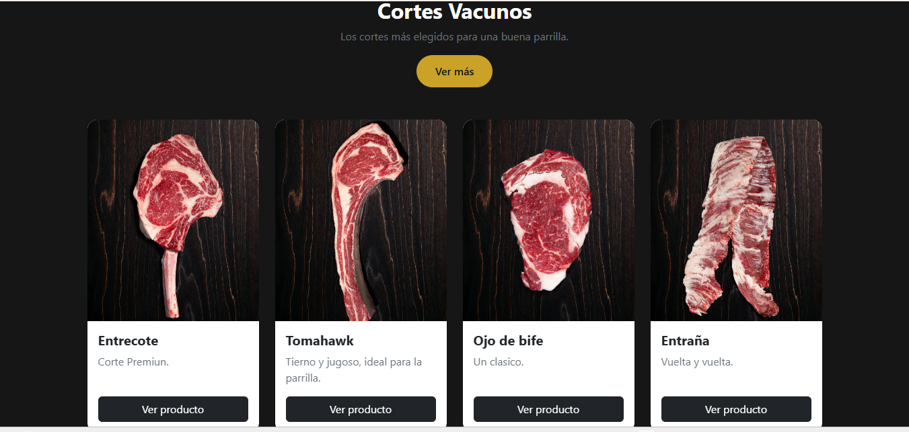
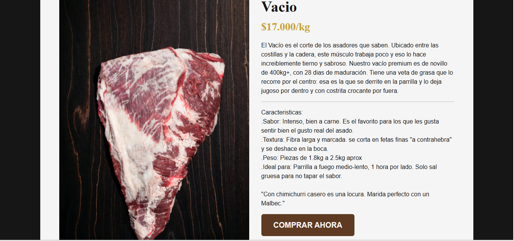

#  La Reserva del Asador




Sitio web desarrollado para **La Reserva del Asador**, un restaurante especializado en carnes y parrilla. El proyecto fue realizado como parte de una práctica de desarrollo web, aplicando tecnologías modernas para crear una experiencia atractiva, intuitiva y adaptable a distintos dispositivos.

---

## Descripción

La Reserva del Asador es un sitio web diseñado para presentar la identidad del restaurante, su propuesta gastronómica y facilitar el contacto con los clientes.

El proyecto cuenta con un diseño responsive, navegación intuitiva y una estructura organizada que permite una excelente experiencia de usuario tanto en computadoras como en dispositivos móviles.

---

##  Características

- ✅ Diseño moderno y responsive.
- ✅ Navegación intuitiva.
- ✅ Página de inicio atractiva.
- ✅ Sección de productos.
- ✅ Galería de imágenes.
- ✅ Formulario de contacto.
- ✅ Diseño adaptable a celulares, tablets y computadoras.

---

##  Tecnologías utilizadas

- HTML5
- CSS3
- JavaScript
- Bootstrap 5
- Git
- GitHub

---

## 📂 Estructura del proyecto

```text
LaReservaDelAsador
📂 Estructura del proyecto
LaReservaDelAsador/
│
├── assets/
│   └── img/
│
├── css/
│   ├── style.css
│   ├── Categoria.css
│   ├── contactos.css
│   ├── detalledeProducto.css
│   ├── login.css
│   ├── registro.css
│   └── error404.css
│
├── pages/
│   ├── Categoria.html
│   ├── Contacto.html
│   ├── Nosotros.html
│   ├── carrito.html
│   ├── detalledeProducto.html
│   ├── detalledeProducto1.html
│   ├── detalledeProducto2.html
│   ├── login.html
│   ├── registro.html
│   └── error404.html
│
└── index.html
```

---

## 📸 Capturas del proyecto

### 🏠 Página principal



### 🍽️ Catalogo



### Detalle de Producto


                                                                                                                                                                                                                

---

## ⚙️ Instalación

1. Clonar el repositorio.

```bash
https://github.com/marianogabrielgzl-byte/LaReservaDelAsador.git
```

2. Ingresar a la carpeta del proyecto.

```bash
cd LaReservaDelAsador
```

3. Abrir el archivo `index.html` en el navegador.

---

## 📋 Funcionalidades

- Página de inicio.
- Información del restaurante.
- Catálogo de productos.
- Galería de imágenes.
- Formulario de contacto.
- Navegación responsive.

---

## 👥 Integrantes

| Mariano Gonzalez |
| Maximo Paz|
| Matias|

---

## 📌 Estado del proyecto

🟢 Finalizado.

---

## 📄 Licencia

Este proyecto fue desarrollado con fines educativos.

---

## 👨‍💻 Autor

Proyecto desarrollado por el equipo de trabajo para la materia de Desarrollo Web.
